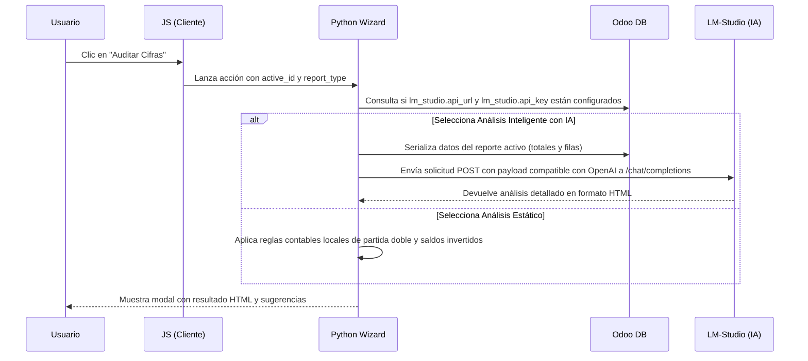

# Guía Técnica de Auditoría Contable y Panel de Anomalías

Esta guía técnica detalla la arquitectura, los componentes y el funcionamiento del sistema de auditoría estática e inteligente (IA) integrado en los reportes financieros dinámicos.

---

## 1. Arquitectura de la Solución

El sistema consta de tres componentes principales:

1. **Interfaz (QWeb / JS)**: Botón "Auditar Cifras" añadido a cada reporte dinámico.
2. **Acción de Ventana (Odoo Action)**: Acción de Odoo que lanza el asistente (`ai.financial.audit.wizard`) pasando el contexto del reporte activo.
3. **Motor de Reglas y Conexión de IA (Python Backend)**: El asistente lee el estado y datos del reporte, permitiendo alternar entre reglas estáticas tradicionales y el Análisis Inteligente vía IA usando la API de LM-Studio.

### Flujo de Datos

---

## 2. Componentes del Servidor (Backend)

### Modelo: `ai.financial.audit.wizard`
Ubicado en: [wizard/financial_audit.py](file:///mnt/extra-addons/CybroAddons/dynamic_accounts_report/wizard/financial_audit.py)

#### Campos Principales:
* `report_type` (Char): Almacena el tipo de reporte origen (`trial_balance`, `general_ledger`, etc.).
* `audit_type` (Selection): Permite escoger entre:
  * `static`: Análisis Estático (Reglas Contables).
  * `ai`: Análisis Inteligente con IA (LM-Studio).
* `is_ai_configured` (Boolean): Campo computado que verifica si los parámetros de sistema de LM-Studio existen en Odoo.
* `result_html` (Html): Campo computado que ejecuta el análisis dinámicamente según la opción elegida.

---

## 3. Configuración del Servidor LM-Studio para IA

Para que el análisis inteligente funcione, el administrador de Odoo debe registrar los siguientes **Parámetros del Sistema** (`ir.config_parameter`):

1. **`lm_studio.api_url`**: La URL base del servidor local o remoto de LM-Studio (ej: `http://localhost:1234/v1`).
2. **`lm_studio.api_key`**: Token o clave de autenticación para el servidor.
3. **`lm_studio.model`** (Opcional): El identificador del modelo LLM cargado en LM-Studio (por defecto: `lmstudio-community/meta-llama-3-8b-instruct`).

### Flujo de Validación del Backend:
* Si el usuario selecciona **Análisis Inteligente con IA**, el sistema verifica si la URL y el Token están configurados.
* Si falta alguno de los dos, se revierte automáticamente a **Análisis Estático** y se le muestra una alerta al usuario detallando los parámetros faltantes.
* Existe una regla `@api.constrains('audit_type')` que previene cualquier bypass técnico si los parámetros no están en la base de datos.
